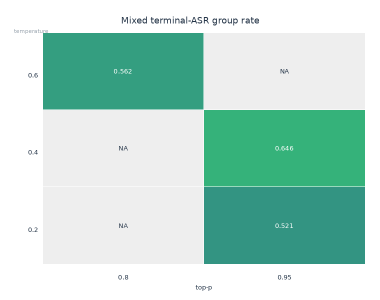
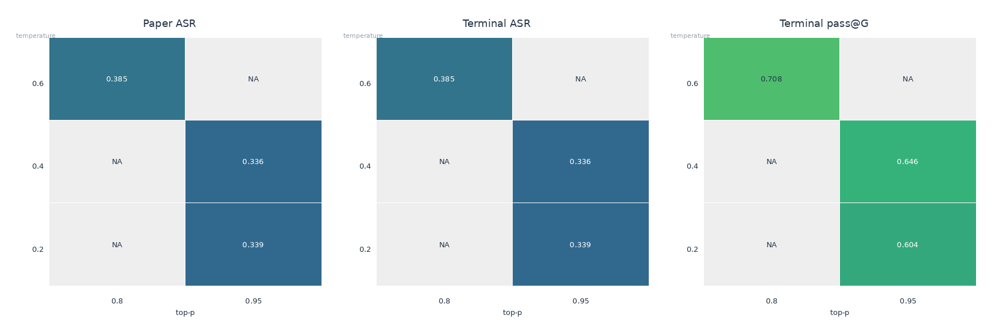
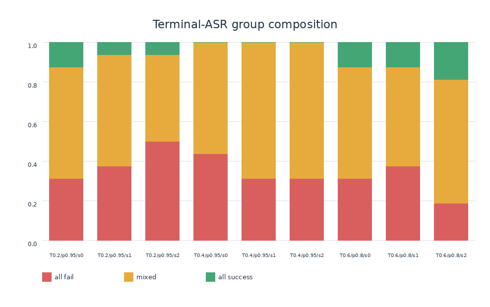
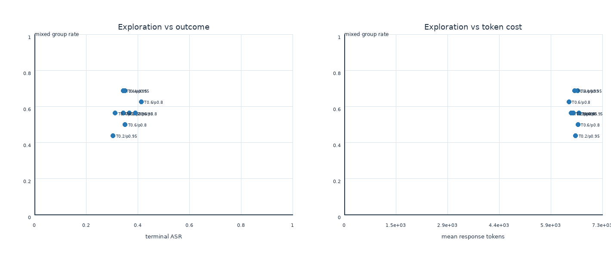
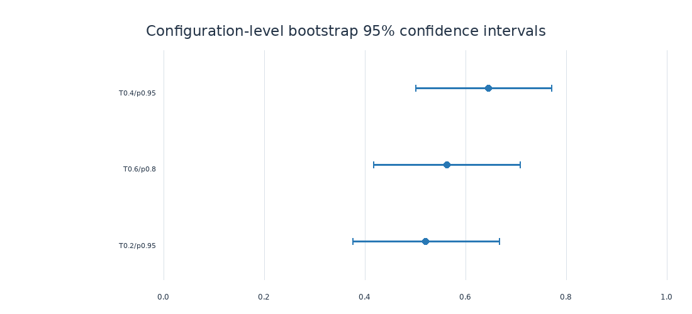
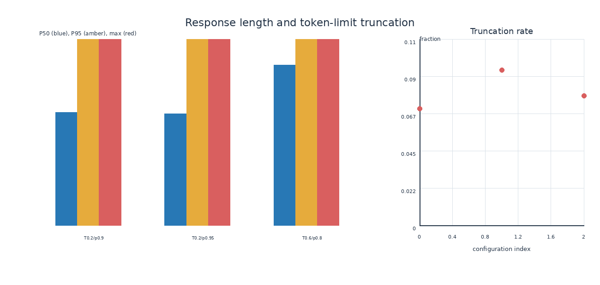
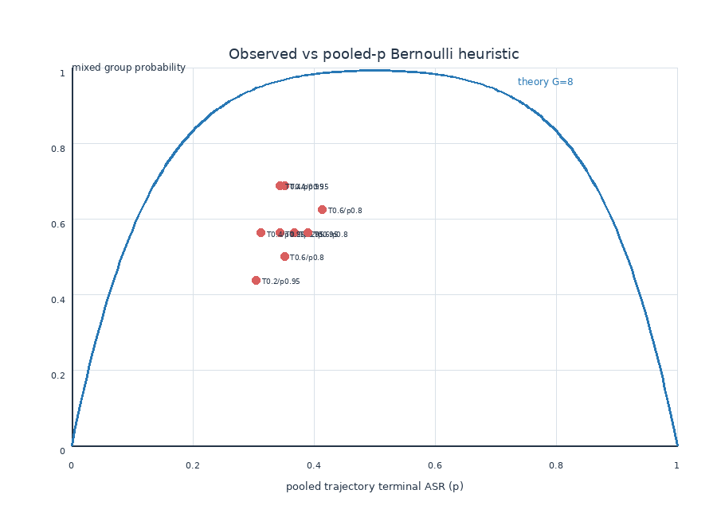
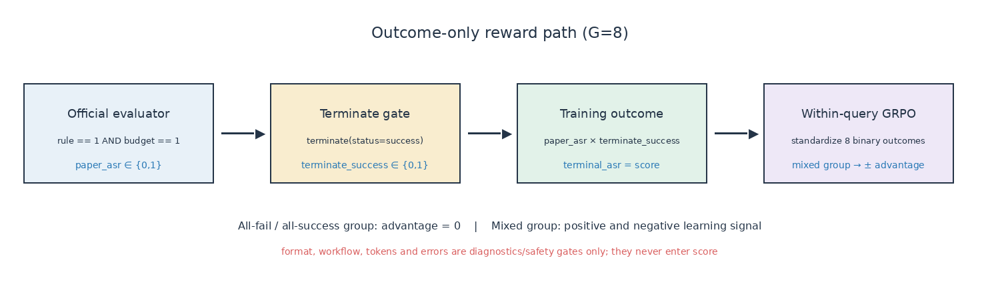

# Step108 Outcome-Only GRPO 采样参数探索

Date: 2026-07-10

## 0. 最终结论与锁定配置

**参数搜索已经结束。** 在 calibration16 的 15 点网格、三个长度反事实以及 validation16
top-3 × 3 seeds 共 3456 条正式采样轨迹上，最终锁定后续 GRPO rollout 配置为：

```text
initial checkpoint       = global_step_108
training temperature     = 0.4
training top_p           = 0.95
validation temperature   = 0.2
validation top_p         = 0.9
group size G             = 8
max response length      = 10240
PPO token budget / GPU   = 12288 (execution safety; not a sampling parameter)
max assistant/user turns = 15 / 15
top_k                    = -1
repetition penalty       = 1.0
max_num_seqs             = 8 per vLLM engine
engine generation n      = 1
GPU / engine layout      = 2 × A800, TP=1, two engines
prefix cache             = on
stable sampling          = on
training score           = terminal_asr (binary outcome only)
```

正式 4B RL launcher 已把训练默认值固定为 `0.4/0.95`，同时保留环境变量覆盖，因此随时可以
回退；验证默认值仍是 `0.2/0.9`。已知会在首个 backward OOM 的 PPO execution token budget
32768 也固定为 12288；它只控制每 GPU 的训练微批 token 上限，不改变 rollout 分布或 G。
胜出理由不是它的 raw ASR 最高，而是它在互斥 validation16
的三 seed 复验中具有最高的 mixed-group rate 及其 bootstrap 95% CI 下界：64.58%，CI
50.00%–77.08%。这意味着 G=8 中更经常同时出现成功和失败，能给 outcome-only GRPO 提供非零
的组内 advantage。

`T=0.6, top_p=0.8` 的 terminal ASR 更高（38.54% vs 33.59%），但 mixed-group rate 更低
（56.25% vs 64.58%），因此只保留为“偏推理成功率”的 runner-up，不能替换本轮以可学习信号
为主目标的 winner。16384 response length 已被反事实实验否决：它没有稳定降低截断，反而
增加 token 和 wall time，所以长度固定回 10240。

## 1. 问题与目标

本实验从 SFT checkpoint `global_step_108` 出发，寻找最适合后续 GRPO 训练的 rollout
sampling 参数。搜索对象首先限定为 temperature 与 top-p；学习率、KL、clip、loss aggregation
保持不变，避免把采样探索和优化器探索混在一起。

这次不使用 dense progress reward，也不把 format、tool-valid、step penalty 加进训练 reward。
训练只使用一个二元最终结果：

```text
paper_asr     = 官方 ShoppingBench 商品相关性约束成功 AND 券后预算成功
terminal_asr  = paper_asr AND terminate(status="success")
training score = terminal_asr ∈ {0, 1}
```

`terminal_asr` 比论文 ASR 多一个 agent 完成流程的终止条件，因此所有结果必须同时报告
`paper_asr` 和 `terminal_asr`，不能把二者混称为 ASR。

## 2. 为什么不选择“reward 方差最大”

当前 GRPO 对同一 query 的 G 条轨迹做组内标准化：

\[
A_i = \frac{r_i - \bar r}{\operatorname{std}(r)+10^{-6}}.
\]

对于 binary outcome：

- 一组全为 0：advantage 全为 0；
- 一组全为 1：advantage 全为 0；
- 一组同时有 0 和 1：产生明确的正负 advantage。

所以采样参数的首要目标是提高 `mixed_terminal_asr_group_rate`，而不是无条件最大化 raw
variance。若单条轨迹成功概率为 `p`，G=8 时理论 mixed-group 概率为：

\[
1-p^8-(1-p)^8.
\]

该概率在成功率接近 50% 时最大，但实际选参还必须通过格式、截断、runaway、workflow 和
吞吐安全门，避免用系统性损坏换取表面上的探索性。

需要注意，公式中的 `p` 应当是**同一个 query 的条件成功率**。若直接把所有 query 的 pooled
ASR 代入，只能得到一个 iid heuristic，而不是实际 mixed rate 的无偏预测。低温三组用 pooled
ASR 得到的理论 mixed 概率约为 93.5%–96.2%，实际只有 62.5%–68.8%；这说明 query 难度高度
异质，部分 query 几乎总失败，不能用“把总体 ASR 调到 50%”替代真正的逐 query group 分析。
理论/实际图保留这个差异，正是为了展示为什么最终排序必须直接使用 observed mixed groups。

## 3. ASR 对齐边界

论文 Coupon & Budget 的成功条件由产品相关性和预算约束组成。仓库官方 evaluator 位于
`src/agent/run_evaluate.py`，其核心口径是：

```text
paper_asr = (rule == 1) and (budget == 1)
```

产品匹配优先接受 exact product ID；替代商品使用 title similarity、price、service、SKU 和
attributes 规则。预算重新读取商品价格，并按 platform/shop voucher、threshold、fixed 或
percentage discount 与 cap 计算。

历史 `scripts/reward_shoppingbench_final_success.py` 只是把当前内部 `final_success` 改成 0/1，
其商品匹配与 terminate 条件并不等于论文 evaluator，因此不能作为本次训练 reward 的最终
实现。

## 4. 已排除的历史实验

2026-07-09 的 temperature/top-p 尝试发生在 async vLLM `max_num_seqs` 尚未真正传入 engine
时。旧 `top_p=0.7/0.9` 两组还同时改变了 agent workers、max parallel calls 和 engine 压力，
temperature 0.4 在生成前终止，0.6/0.8/1.0 没有运行。因此旧结果只作为故障历史，不参与
本轮参数排名。

当前可信 baseline 为修复并发后的：

```text
checkpoint=global_step_108
temperature=0.2
top_p=0.9
G=8
max_num_seqs=8（实际传入 vLLM）
8 queries / 64 trajectories
format=1.0
旧 final_success=13/64=20.3%
```

该 baseline 使用旧 reward 统计，paper ASR 与 terminal ASR 将由新 scorer 重新计算。

## 5. 固定实验条件

- Checkpoint：`global_step_108`
- GPU：2 × A800 80GB
- Tensor parallel：1，两个 rollout engines
- G：8
- Engine `max_num_seqs`：8
- Prefix caching：开启
- CUDA Graph：开启（`enforce_eager=False`）
- Stable sampling：开启，请求 seed 与逻辑 trajectory 绑定
- Max response：10240
- Max assistant/user turns：15
- Top-k：-1
- Repetition penalty：1.0
- Validation sampler：temperature 0.2、top-p 0.9，和训练 sampler 分离

这里的 `max_num_seqs=8` 不是 G，也不是 batch size；它是**每个 vLLM engine 同一时刻允许
处于调度状态的 sequence 上限**。本实验有两个 TP=1 engine，G=8 的轨迹以 `engine n=1`
的独立请求进入调度。这个上限用于控制单 engine 的 KV-cache/调度并发，避免此前 G 改变时
并发压力也暗中改变，不能把它解释成“每个 query 只生成 8 条”的采样参数。

## 6. 数据划分

参数搜索不直接使用最终 test75。我们从 `dataset/shoppingbench_query/train.parquet` 的 675 条
训练 query 中确定性构造两个互斥的分层 probe：

- calibration16：15 点粗筛；
- validation16：top-3 多 seed 复验和短 RL pilot 监控；
- test75：参数和训练方案锁定后，只做最终对照。

分层维度包括 voucher type、discount type、商品数量、预算余量和 voucher threshold 难度。

## 7. 搜索空间与选择规则

粗筛网格：

```text
temperature = [0.2, 0.4, 0.6, 0.8, 1.0]
top_p       = [0.8, 0.9, 0.95]
```

安全门：format ≥ 0.98，轨迹完整率 100%，server/JSON/truncation/runaway 合计 ≤ 1%，workflow
valid 不得比修复后 baseline 下降超过 5 个百分点。

通过安全门后按以下顺序选择：

1. mixed terminal-ASR group rate 的 bootstrap 95% CI 下界；
2. mixed paper-ASR group rate；
3. pass@8；
4. terminal ASR mean；
5. response tokens 与 wall time。

## 8. 实验流水账

本节在运行过程中追加每个阶段的命令、manifest、异常和结论。机器可读报告保存于
`reports/step108_outcome_sampling_20260710/`，原始轨迹保存于
`rollouts/step108_outcome_sampling_20260710/`。

### 8.1 实现与 scorer parity

状态：完成。

实现文件：`scripts/reward_shoppingbench_asr_batch.py`。它通过 VERL `BatchRewardManager` 一次
接收整个 reward batch；exact-ID 路径不加载 embedding 模型，只有替代商品才在 CPU 上以
Qwen3-Embedding-0.6B 批量编码去重后的 title，并在进程内缓存 embedding。输出字段为：

```text
paper_asr, terminate_success, terminal_asr, rule, budget, score
```

同时保留 format、workflow、token length 等诊断字段，但这些字段不进入 `score`。验收结果：

- 13 个 tests 全部通过：其中 golden cases 覆盖 exact ID、语义替代、属性不匹配、缺商品、两类 voucher、
  threshold、fixed/percentage/cap、跨店、预算失败、缺 terminate 和 malformed tool call；
- 从当前 train parquet 抽取的 12 个真实 exact-ID 样例，与 `src/agent/run_evaluate.py` 的
  `rule`、`budget`、`paper_asr` 逐项一致；
- 另一个非 exact-ID 语义替代样例的 `rule=1/3`、`budget=0` 与官方 evaluator 一致；
- 64 条 exact-ID batch 用时 3.42 秒（约 53 ms/trajectory），embedding 模型未加载，且没有
  使用 rollout GPU；
- 所有训练 scalar 都满足 `score ∈ {0,1}` 且
  `score == paper_asr * terminate_success == terminal_asr`。
- GRPO advantage test 确认：G=8 的全 0 与全 1 组 advantage 全为 0，mixed 组同时产生正负
  advantage。

粗筛第三组给出了包含真实语义替代路径的开销测量：128 trajectories 中批量编码 41 个唯一
title，整个 CPU reward batch 用时 4.20 秒，占 480 秒 run wall time 的 0.88%。这低于预设的
10% 阈值，所以不启用磁盘持久化 embedding cache；进程内 title cache 保留，用于训练多 step
重复出现的 title。该测量字段随 trajectory 写盘，后续 run 继续监控。

训练/验证采样参数已经拆成独立入口：
`TRAIN_ROLLOUT_TEMPERATURE/TOP_P` 与 `VAL_ROLLOUT_TEMPERATURE/TOP_P`。outcome-only launcher
默认加载新 batch scorer；原 dense scorer 仍可通过显式 reward mode 回退，现有 G=4 训练入口
也不再硬编码旧 scorer。

### 8.2 Calibration 15-point sweep

状态：完成，但 **0/15 配置通过硬门槛**。共运行 1920 条 trajectory，纯 run wall time 合计
7171 秒（约 1.99 小时）。首组为 `temperature=0.2, top_p=0.8, seed=0`，16 queries × G=8；启动日志已
确认 checkpoint=step108、max response=10240、15 turns、`max_num_seqs=8`，且 vLLM 实际收到
`n=1, temperature=0.2, top_p=0.8, top_k=-1, repetition_penalty=1.0`。

首组结果（calibration16）：

```text
paper_asr = terminal_asr = 37/128 = 28.91%
mixed groups = 11/16 = 68.75%  (query bootstrap 95% CI: 43.75%–87.50%)
pass@8 = 11/16 = 68.75%
format = 100%
workflow_valid = 81.25%
response tokens: mean 7503, P50 8682, P95/max 10240/10240
token-limit truncation = 10/128 = 7.81%
wall time = 483 s
```

它的 mixed rate 很高，但因截断率超过预注册的 1% 上限而不通过硬门槛。这个结果是本次选择
逻辑的一个直接例子：如果只最大化 reward variation，会偏好一个训练信号看似丰富、实际却
存在明显不完整轨迹的配置。截断样例既包括长工具状态挤满 response budget，也包括低温下的
重复生成；二者都作为 rollout 可靠性问题统计，不能当成普通失败样本掩盖。

低温完整三组的阶段性对照：

| temperature | top-p | paper/terminal ASR | mixed groups | pass@8 | truncation | gate |
|---:|---:|---:|---:|---:|---:|:---|
| 0.2 | 0.80 | 28.91% | 68.75% | 68.75% | 7.81% | fail |
| 0.2 | 0.90 | 30.47% | 62.50% | 62.50% | 12.50% | fail |
| 0.2 | 0.95 | 33.59% | 68.75% | 75.00% | 7.03% | fail |

三组 format 均为 100%，淘汰原因均为 token-limit truncation，而不是 outcome signal 不足。

在 `T=0.4, top_p=0.8` 后首次加入 JSON-failure 诊断时，scorer 曾把 VERL trajectory messages
中的内部 executed-tool event 当成模型原始 JSON，报告 128/128 malformed。这个结果与
`format=100%` 冲突。回查原始 `output` 并用独立 parser 重算为 0/128，确认是假阳性；随后把
在线判断收窄到 decoded model solution，离线分析则始终从原始 `<tool_call>` 文本重建，不再
信任该过渡字段。这个插曲没有改变 reward 或轨迹，但说明诊断器本身也必须做 consistency
check，不能因为字段名字看起来正确就直接用于筛选。

完整结果如下。`failure` 是 server/JSON/truncation/runaway 的 trajectory-level union，不会把
同一条轨迹重复计数；所有配置的 server error 均为 0。

| T | top-p | terminal ASR | mixed | pass@8 | format | workflow | trunc | JSON | failure | gate |
|---:|---:|---:|---:|---:|---:|---:|---:|---:|---:|:---|
| 0.2 | 0.80 | 28.91% | 68.75% | 68.75% | 100.00% | 81.25% | 10 | 0 | 7.81% | fail |
| 0.2 | 0.90 | 30.47% | 62.50% | 62.50% | 100.00% | 86.72% | 16 | 0 | 12.50% | fail |
| 0.2 | 0.95 | 33.59% | 68.75% | 75.00% | 100.00% | 84.38% | 9 | 0 | 7.03% | fail |
| 0.4 | 0.80 | 28.91% | 62.50% | 68.75% | 100.00% | 85.94% | 9 | 0 | 7.03% | fail |
| 0.4 | 0.90 | 20.31% | 62.50% | 62.50% | 98.16% | 89.06% | 7 | 3 | 7.03% | fail |
| 0.4 | 0.95 | 28.91% | 68.75% | 68.75% | 100.00% | 90.62% | 8 | 1 | 7.03% | fail |
| 0.6 | 0.80 | 31.25% | 68.75% | 68.75% | 99.38% | 85.16% | 7 | 1 | 6.25% | fail |
| 0.6 | 0.90 | 26.56% | 62.50% | 62.50% | 100.00% | 86.72% | 7 | 0 | 5.47% | fail |
| 0.6 | 0.95 | 24.22% | 43.75% | 43.75% | 99.26% | 88.28% | 6 | 3 | 7.03% | fail |
| 0.8 | 0.80 | 29.69% | 56.25% | 62.50% | 99.80% | 85.94% | 13 | 1 | 10.94% | fail |
| 0.8 | 0.90 | 27.34% | 68.75% | 68.75% | 99.90% | 80.47% | 9 | 1 | 7.81% | fail |
| 0.8 | 0.95 | 24.22% | 56.25% | 56.25% | 99.75% | 84.38% | 8 | 1 | 7.03% | fail |
| 1.0 | 0.80 | 23.44% | 56.25% | 56.25% | 99.90% | 84.38% | 3 | 2 | 3.91% | fail |
| 1.0 | 0.90 | 21.88% | 50.00% | 50.00% | 99.76% | 80.47% | 7 | 4 | 8.59% | fail |
| 1.0 | 0.95 | 23.44% | 62.50% | 68.75% | 98.59% | 76.56% | 6 | 4 | 7.03% | fail |

粗筛结论不是“最佳 temperature 是某个值”，而是：**在 max response=10240、15 turns 和当前
state 表示固定时，temperature/top-p 搜索没有可行解**。所有 15 个点都超过 1% failure 门槛；
其中 4 个点还超过 workflow 相对 baseline 的 5 个百分点容忍度。最接近可靠性门槛的是
`T=1.0, top_p=0.8`，但 5/128=3.91% 仍明显不合格，而且它的 mixed/ASR 只有 56.25%/23.44%。
探索信号较好的 `T=0.6, top_p=0.8` 则有 68.75% mixed 和 31.25% ASR，但 failure 仍为 6.25%。

15 组共有 125/1920 条 token-limit truncation。它们不是单一随机坏点：最困难的 calibration
query 在 120 条跨配置轨迹中分别截断 21、16、13 次，且包括三到四商品 same-shop voucher
约束；16 个 query 中有 4 个在全部 15 个配置下都没有成功轨迹。说明长度失败主要由任务/状态
预算的结构性压力驱动，sampling 只能移动比例，不能根治。

另一个观测是本 probe 上 `paper_asr == terminal_asr`：所有论文口径成功的轨迹也都执行了
`terminate(success)`。这不代表两个定义可合并；terminate gate 在其他 checkpoint 或训练后仍
可能产生差异，所以字段和最终 test 继续分开报告。

#### 8.2.1 放宽 response budget 的反事实实验

为验证 10240 是否只是过小，我们没有重跑全网格，而是从已有 1920 条轨迹中选择三个信息量
最大的配置，把 response length 提到 16384，model length 与 max batched tokens 同步提到
18432；G、max_num_seqs、seed、query 和其余条件保持不变。

| T | top-p | length | ASR | mixed | trunc | mean tokens | P50/P95 | wall time |
|---:|---:|---:|---:|---:|---:|---:|---:|---:|
| 0.2 | 0.95 | 10240 | 33.59% | 68.75% | 9 | 7305 | 8861 / 10240 | 480 s |
| 0.2 | 0.95 | 16384 | 28.91% | 68.75% | 12 | 10239 | 9819 / 16384 | 663 s |
| 0.6 | 0.80 | 10240 | 31.25% | 68.75% | 7 | 7251 | 8616 / 10238 | 477 s |
| 0.6 | 0.80 | 16384 | 30.47% | 56.25% | 10 | 10590 | 14092 / 16384 | 670 s |
| 0.2 | 0.90 | 10240 | 30.47% | 62.50% | 16 | 7513 | 8849 / 10240 | 501 s |
| 0.2 | 0.90 | 16384 | 28.12% | 56.25% | 9 | 10171 | 9923 / 16384 | 676 s |

仅 baseline 的截断数下降，但仍是 7.03%；另外两组反而增加。三组平均 token 与 wall time 都
显著上升，P95 继续顶到新上限。这证明主要问题不是“还差几千 token 才完成”，而是部分 policy
在缺少终止决策时会消费所有可用预算。最终训练长度因此回到 10240；继续无限加 context 既不
解决行为，也会显著降低 RL 吞吐。

#### 8.2.2 门槛口径的实验后修订

原方案把 token-limit 与 server crash/JSON failure 放在同一个 ≤1% hard gate。反事实实验表明
token-limit 对 length budget 呈行为响应：轨迹仍完整写盘、reward 可确定为 0，而且正是
outcome-only RL 应学习避免的 noncompletion。它与无法形成训练样本的基础设施错误不是同一类。

因此后续采用双层口径，并保留原报告以避免事后改写历史：

```text
infrastructure hard gate = server error OR malformed JSON OR runaway <= 1%
token-limit noncompletion = 单独报告，terminal_asr=0，允许作为负样本进入 GRPO
```

在这个口径下 8/15 配置可进入排序，top-3 为：

1. `T=0.2, top_p=0.95`：mixed 68.75%，pass@8 75%，ASR 33.59%；
2. `T=0.6, top_p=0.8`：mixed 68.75%，pass@8 68.75%，ASR 31.25%；
3. `T=0.4, top_p=0.95`：mixed 68.75%，pass@8 68.75%，ASR 28.91%。

这不是把 truncation 隐藏或改成成功；它仍明确计数、reward 仍是 0。修订只改变“这种可学习
失败是否应阻止进入 RL”的判断。机器报告分别保存为原始 `coarse_analysis.json` 与修订后的
`coarse_outcome_eligible_analysis.json`。

### 8.3 Validation top-3 × 3 seeds

状态：完成。使用上面的双层 failure 口径，在互斥 validation16 上对 top-3 运行 seed 0/1/2；
response 恢复为 10240。9/9 runs 通过 infrastructure gate。

| T | top-p | mixed (48 groups) | bootstrap 95% CI | pass@8 | terminal ASR | mean tokens |
|---:|---:|---:|---:|---:|---:|---:|
| 0.4 | 0.95 | 64.58% | 50.00%–77.08% | 64.58% | 33.59% | 6614 |
| 0.6 | 0.80 | 56.25% | 41.67%–70.83% | 70.83% | 38.54% | 6510 |
| 0.2 | 0.95 | 52.08% | 37.50%–66.67% | 60.42% | 33.85% | 6504 |

`T=0.6, top_p=0.8` 的 raw success 更高，但 `T=0.4, top_p=0.95` 的 mixed CI 下界最高。
依照预先定义的 GRPO 学习信号优先级，后者是 sampling sweep winner；前者保留为高-ASR
runner-up，而不是事后改用 ASR 覆盖主目标。

### 8.4 12-step GRPO pilots

状态：**按 2026-07-10 的收口决定停止，不参与 sampling winner 的判定。**

winner pilot 的 step-0 固定验证采样得到 terminal ASR 37.50%、mixed 43.75%、pass@8 56.25%；
它只说明验证入口可运行，不是训练后结果。第一次训练启动在首个 backward 前因
`ppo_max_token_len_per_gpu=32768` 触发 CUDA OOM，没有完成任何 optimizer step，也没有写出
checkpoint。随后将 pilot execution token budget 降为 12288，并启用 expandable CUDA memory
segments；这只修复 pilot 的执行显存边界，没有改变 G、采样参数、LR 或 reward。重启后根据
本次“先固定采样参数并落实文档”的要求主动停止，仍未完成训练 step。

当前 GPU/Ray 进程已清空；保留的 `manifest.json`、`run.log` 和 `validation/0.jsonl` 明确作为
aborted smoke-test 证据，不生成、也不展示伪造的 learning curve。换言之，本文锁定的是
**step108 rollout sampling 参数**，不是宣称 12-step RL 已证明最终收敛收益。

### 8.5 Test75 最终对照

状态：未启动。sampling 参数已由 train-derived calibration/validation probes 锁定，但没有
完成可比较的 pilot checkpoint，所以本轮不消耗 test75。它继续保持 untouched，只在后续真正
完成 GRPO checkpoint 后与 step108 各评测一次，不能用于继续调 sampling 参数。

## 9. 图表

所有已完成实验都同时生成 PNG 与 SVG。正式解释使用三组目录：

- `coarse_outcome_eligible/`：15 点 calibration 粗筛，使用最终的双层 failure 口径；
- `confirm/`：top-3 × 3 seeds 的 validation16 复验，是最终参数选择的主证据；
- `len16384/len16384/`：response budget 16384 反事实，用于判断截断是否只是长度不足。

### 9.1 Mixed terminal-ASR 热力图



calibration 上多个点都达到 68.75%，表明单 seed、16 query 的粗筛存在明显平台区；换到互斥
validation16 并合并三 seed 后，`0.4/0.95` 保持 64.58%，领先 `0.6/0.8` 的 56.25% 和
`0.2/0.95` 的 52.08%。结论是 temperature 并非越高越探索，必须用逐 query mixed groups
直接测量。

### 9.2 Paper ASR、terminal ASR 与 pass@8



图中 `0.6/0.8` 的 terminal ASR 38.54%、pass@8 70.83% 均最高，但它的 mixed rate不是最高。
如果目标是单次离线推理成功率，会选择它；如果目标是给 binary-outcome GRPO 产生正负
advantage，则应选择 `0.4/0.95`。本 probe 上 paper ASR 与 terminal ASR 数值恰好相同，只能
说明所有 paper-success 轨迹也正确 terminate，不能合并两个指标的定义。

### 9.3 All-fail / mixed / all-success 组成



堆叠图显示平均 ASR 相近时，组组成仍可能不同。全 0 和全 1 组对当前 GRPO 都没有组内梯度，
因此不能只看 trajectory-level mean；`0.4/0.95` 的优势来自把更多 query 推入 mixed 区，而非
简单提高成功总数。

### 9.4 探索信号—成功率—成本 Pareto



三组在 10240 budget 下的平均 response token 很接近（6504–6614），所以 winner 的 mixed
优势不是通过显著多生成 token 换来的。`0.6/0.8` 是 ASR 方向的 Pareto 选项，`0.4/0.95` 是
GRPO mixed-signal 方向的 Pareto 选项；主目标决定最终选后者。

### 9.5 三 seed bootstrap 置信区间



最终排序按 CI 下界而不是点估计：`0.4/0.95` 下界 50.00%，`0.6/0.8` 为 41.67%，
`0.2/0.95` 为 37.50%。区间仍然较宽，说明 48 个 query-groups 足以做工程锁定，但不应把几个
百分点解释成普适规律；这也是保留 runner-up 和可覆盖回退入口的原因。

### 9.6 长度与截断反事实



把上限从 10240 提至 16384 后，三组 P95 仍触顶；两组截断数增加，一组虽下降但仍为 7.03%。
平均 token 和 wall time 同时显著上升。这支持“部分轨迹缺少终止决策、会持续消费可用 budget”
而不是“只差固定几千 token 就能完成”，所以 16384 被排除。

### 9.7 理论 mixed rate 与真实观测



把 pooled ASR 当成同质 Bernoulli 概率时，`1-p^8-(1-p)^8` 系统性高估真实 mixed rate。原因是
query 难度异质：有些 query 几乎总失败或总成功。图像证明不能用总体 reward variance 或总体
ASR 替代 query-conditioned group 统计。

### 9.8 Outcome reward 流程



流程图固定了指标语义：官方 evaluator 先产生 `paper_asr`，再经过 terminate-success gate 得到
`terminal_asr`，训练只把后者作为 0/1 score，最后在同 query 的 G=8 内形成 advantage。format、
workflow、长度和错误率只做诊断，不参与 reward shaping。

没有 `08_pilot_learning_curves`：pilot 未完成任何训练 step，故不使用空数据连线，也不把
step-0 验证伪装成学习曲线。

## 10. 限制

- 本轮只搜索 rollout sampling 参数，不同时搜索训练 optimizer 超参数。
- sampling winner 来自 rollout 统计，没有完成短 RL pilot，因此尚未验证 12-step 学习曲线 AUC
  是否也领先 baseline；这是参数锁定后的训练验证问题，不再用 test75 反向调参。
- `terminal_asr` 是本项目选择的更严格训练 outcome；跨论文比较必须使用单独报告的
  `paper_asr`。
- 10240 下仍存在约 3%–12.5% 的 token-limit noncompletion；它被明确记为 outcome 0，而不是
  基础设施成功。server/JSON/runaway 才进入 ≤1% infrastructure hard gate。若后续要降低这类
  行为失败，应研究终止行为或 state/tool observation，而不是继续无限增加 context。
- validation16 × 3 seeds 共 48 个 query-groups，置信区间仍较宽；该结果足以固定工程默认值，
  不足以声称 `0.4/0.95` 对所有 checkpoint、数据分布或 G 都是全局最优。

## 11. 实验规模、数据来源与可审计产物

| 阶段 | Query 来源 | 配置/seed | Trajectories | 用途 |
|---|---|---:|---:|---|
| calibration 粗筛 | train675 的分层 calibration16 | 15 × 1 | 1920 | 全网格筛选 |
| 16384 反事实 | 同一 calibration16 | 3 × 1 | 384 | 排除盲目加长 |
| validation 复验 | train675 的互斥 validation16 | 3 × 3 | 1152 | 最终排名 |
| 合计 | 32 个互斥 train-derived queries | 27 runs | 3456 | 不含 aborted pilot step-0 |

上表纠正一个容易混淆的计数：正式实验是 **3456 trajectories**；其中直接参与 sampling ranking
的是 1920 + 1152 = 3072，另外 384 条只用于长度反事实。两个 probe 都来自 675 条 train
query，确定性分层且互斥；test75 没有被使用。数据 hash、query index 和分布记录在
`dataset/probe/step108_outcome_sampling/report.json`。

核心机器可读产物：

- `reports/step108_outcome_sampling_20260710/coarse_analysis.json`：原始预注册 hard gate；
- `reports/step108_outcome_sampling_20260710/coarse_outcome_eligible_analysis.json`：双层 failure
  口径下的粗筛排名；
- `reports/step108_outcome_sampling_len16384_20260710/length_recovery_analysis.json`：长度反事实；
- `reports/step108_outcome_sampling_20260710/confirm_analysis.json`：最终 top-3 多 seed 排名；
- `rollouts/step108_outcome_sampling_20260710/*/manifest.json`：checkpoint、参数、seed、数据 hash、
  并发、代码版本和耗时；
- `rollouts/step108_outcome_pilots_20260710/winner_t04_p095/`：停止的 pilot smoke-test，非训练结果。

## 12. 可恢复执行入口

```bash
# 重建互斥 probe（确定性，重复执行 hash 不变）
python scripts/build_outcome_sampling_probes.py

# 15 点 calibration 粗筛；每个完成 run 有 .done，重启会跳过
bash scripts/run_step108_outcome_sampling_sweep.sh coarse

# 自动读取粗筛 top-3，在 validation16 上跑 3 seeds
bash scripts/run_step108_outcome_sampling_sweep.sh confirm

# 可选的后续训练验证；不是重新搜索 sampling 参数
bash scripts/run_step108_outcome_pilots.sh

# 合并胜出 pilot 的 FSDP checkpoint，并仅对 step108/step12 各跑一次 test75
bash scripts/run_step108_outcome_final_test75.sh
```

每一阶段均把原始 trajectory、console log、manifest 和分析 JSON 分开保存。若需要回到原 dense
reward，只需显式设置 `SHOPPINGBENCH_REWARD_MODE=dense`；若需要复现既有 G=4 行为，另设
`ROLLOUT_N=4`，不需要撤销 outcome scorer 或 vLLM 并发修复。
