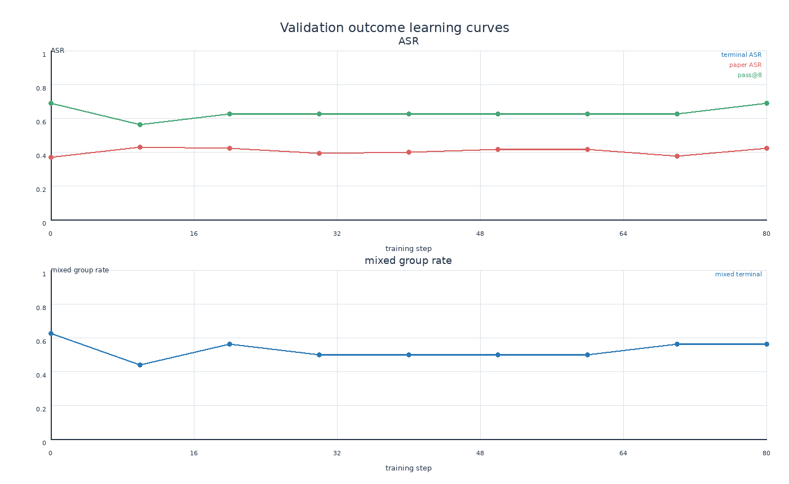
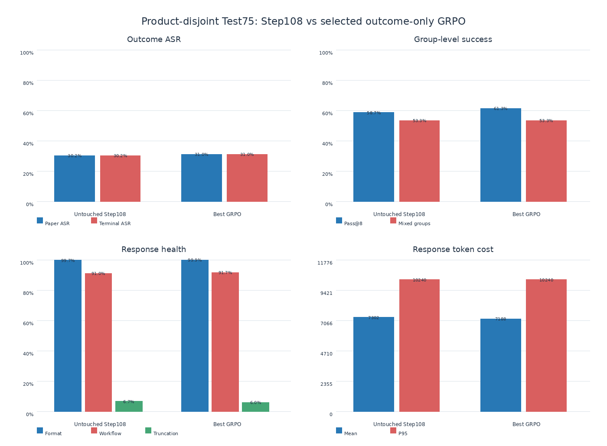

# Step108 Outcome-Only GRPO 正式训练记录

Date: 2026-07-10

## 1. 目标与边界

从 `global_step_108` 和 RL query v2 的 train643 出发，用严格二元
`terminal_asr = paper_asr × terminate_success` 训练 GRPO。训练不使用 progress、format、tool、
length 或 step shaping；这些字段只做诊断。最终 test75 在 validation 选定 checkpoint 前保持
untouched。

## 2. 固定配置

```text
GPU                         = 2 × A800 80GB
train queries               = 643
online validation queries   = 16
initial train batch / G     = 32 / 8
fallback train/PPO batch    = 16 / 8
train sampler               = temperature 0.4, top_p 0.95
validation sampler          = temperature 0.2, top_p 0.9
max response / turns        = 10240 / 15
clip epsilon low/high       = 0.2 / 0.28
actual probability ratio    = [0.8, 1.28]
learning rate               = 1e-6
KL loss / KL reward         = off / off
entropy coefficient         = 0 (entropy is still observed)
loss aggregation            = token-mean
epochs / effective steps    = 2 / 80 (after capacity fallback)
validation / save frequency = 10 / 20 steps
checkpoint contents         = model + extra, keep latest 4
```

`actor/ppo_kl` 是一次 PPO update 内 updated policy 与 rollout/old policy 的诊断距离，不是
reference-model KL loss。由于两条 KL 约束路径都关闭，训练不会创建 reference-policy penalty。

## 3. 容量与磁盘策略

训练先实测 batch32 的持续容量；capacity OOM 后从 step108 干净降级到 batch16，再失败降到
batch8。固定 `max_num_seqs=8`、engine `n=1`、agent workers=8，
避免为了利用率重新引入并发采样混杂。启用 FlashAttention2、remove padding、dynamic microbatch、
prefix cache 与 stable sampling。

启动时磁盘约有 50GB 空闲。一个 4B model-only checkpoint 预计约 8.3GB，四个 milestone 约
33GB；监督器在 18GB 提醒、12GB 硬停止，不删除任何已有 SFT checkpoint。train/validation
trajectory 全量留存，预计不足 1GB，用于 response 与 group-level 复盘。

## 4. 初始 B32 容量实验基线

正式 run 的 step0 validation16 × G8 共 128 条 trajectory：

| Metric | Step0 |
|---|---:|
| paper ASR | 39.06% |
| terminal ASR | 39.06% |
| mixed groups | 50.00% |
| pass@8 | 62.50% |
| all-fail / mixed / all-success | 6 / 8 / 2 |
| format | 98.83% |
| workflow valid | 89.84% |
| token-limit noncompletion | 5.47% |
| response tokens mean / P95 | 6347 / 10233 |

这是先失败的 B32 容量实验基线，因此其 44.06% 相对线不用于最终 B16 run 的 checkpoint 选择。
step0 自身出现 3 条
JSON failure 与 2 条 offline runaway，说明 infrastructure ≤1% 是需要训练改善的目标，而不是
已满足的基线属性。

## 5. 训练流水账

- 启动前：formal dry-run 确认 train643、validation16、batch32、G8、40 steps、save10、val5、
  LR、clip 与 KL 配置全部正确。
- 初始化：VERL runtime 确认 train dataloader=20、val dataloader=1、total steps=40。
- Step0 rollout：两卡生成阶段常见 GPU utilization 82%–91%，显存约 46GB/卡，固定并发已经能
  充分利用 rollout GPU，不需要提高 `max_num_seqs`。
- Step1：首个 batch32 optimizer update 完整通过；reward 32.03%、entropy 0.1120、clip fraction
  0.11%、grad norm 0.891。backward 峰值显存约 81.2GB/81.9GB，因此保留 batch32，但不再提高
  microbatch、KV cache 或关闭 optimizer offload。
- Step5 validation：terminal/paper ASR 41.41%，较 step0 提升 2.34pp；mixed groups 从 50.0%
  升到 62.5%，pass@8 从 62.5% 升到 68.75%；format 100%、infrastructure failure 0%、截断
  4.69%、mean response tokens 6025，全部通过健康门，但尚未达到 44.06% 满意线。
- Step6 capacity failure：前五次 update 都成功，但第六次 backward 申请额外 5.20GiB 时每卡峰值
  已接近 80GiB，GPU0 仅余 3.17GiB，因此失败。这不是 CUDA allocator 碎片：PyTorch 仅有约
  154MiB reserved-but-unallocated。它说明“首次更新成功”不足以证明动态长序列训练的持续容量，
  B32 必须判为不安全配置；由于首个保存点原定 step10，不能恢复这五次更新。
- 监督器缺陷与无效结果：旧监督器只用“是否已有 checkpoint”判断是否属于首次 OOM，并在 Ray
  worker 尚持有约 78GiB 显存时立即启动 B16/B8，导致两次初始化报错。后两者是残留显存污染，
  不构成 B16/B8 容量证据，已明确排除。
- 修复与 fallback：执行 `ray stop --force` 后两卡回到 2MiB；监督器现会在每次失败后停止 Ray、
  等待两卡显存低于 1GiB，记录 `max_completed_step`，再从 step108 重启。正式 fallback 采用
  train batch16、PPO minibatch8，并启用 `free_cache_engine`，在 actor update 前释放 rollout KV
  cache；G8、`max_num_seqs=8`、采样参数及 reward 语义均不改变。
- B16 首次初始化检查发现 `free_cache_engine` 的 CuMemAllocator memory pool 与此前设置的
  `PYTORCH_CUDA_ALLOC_CONF=expandable_segments:True` 明确互斥，vLLM 在加载前主动 assertion；尚未
  产生 rollout 或 update，因此不计作容量失败。空字符串会被下游 `${VAR:-default}` 再次替换，
  故最终显式固定为 `expandable_segments:False`，并保留 free-cache。
  这不会放大已知碎片风险，因为 B32 OOM 时 reserved-but-unallocated 只有约 154MiB。
- 当前状态：B32 容量实验结束；将从干净 step108 启动 B16 的 80-step、2-epoch 正式训练。
- 有效 B16 run：`step108_outcome_grpo_v2_20260710_161427`。step0 validation 为 paper/terminal
  ASR 36.72%、mixed 62.5%、pass@8 68.75%、format 99.41%、workflow 92.19%、截断 6.25%；
  本 run 的相对满意线为 41.72%。基础设施失败 1.56%（2/128 JSON decode）略高于健康门，后续
  保存点仍需降到 1% 以下。
- B16 step1 完整通过：reward 26.56%、entropy 0.1024、clip fraction 0.10%、diagnostic PPO KL
  `-9.4e-5`、grad norm 0.607。监控到 actor update 峰值约 56.5GB/卡，较 B32 的近 80GB 峰值
  留出约 23GB 余量。首轮 PNG/SVG 生成验证通过，训练继续。
- B16 step2–6 全部通过，成功越过 B32 的 step6 失败点。六步 actor 峰值最高约 63.9GB，未见
  跨 step 累积；step6 reward 44.53%、entropy 0.1051、clip 0.094%、grad norm 0.941。前四个
  已分析 train batch 的 mixed-group rate 为 43.75%–62.5%，format 99.83%–100%、infra
  0%–0.78%，没有 advantage signal 或协议健康度塌缩。由此锁定 B16/PPO-mini8/free-cache 为
  当前硬件和 10240 长响应下的稳定正式容量，而 B32 仅作为失败容量实验保留。
- Step10 首次在线 validation：paper/terminal ASR 42.97%，较本 run step0 的 36.72% 提升
  6.25pp，超过 41.72% 满意线；format 100%、infra 0.78%、截断 7.03%、workflow 89.06%，
  健康门通过，mean response 从 6395 降至 6291 tokens。不过 mixed-group rate 由 62.5% 降到
  43.75%，pass@8 由 68.75% 降到 56.25%；尚高于 40% 停止线，但需防止分布继续变尖。
  step10 不是 checkpoint，必须至少训练到 step20 半 epoch保存点后再做候选判断。
- Step20（首个 0.5 epoch checkpoint）：terminal 42.19%（+5.47pp）、mixed 56.25%，但出现
  2/128 JSON decode failure，infra=1.56% 略高于 1% 健康门，因此不能按预注册规则选为最佳。
- Step30/40/50：terminal ASR 分别为 39.06%/39.84%/41.41%，mixed 均为 50%，健康门全部
  通过；其中 step40 是保存点，暂为 health-eligible 最佳 checkpoint，但只提升 3.13pp。
  step50 infra=0%、截断 1.56%，说明系统健康度在改善，但它不是保存点。到 step59 entropy、
  clip、diagnostic KL 均稳定；step27 平均 response 8603 tokens、actor 峰值约 72GB 仍成功。
  尚未满足“保存点 +5pp”，也未触发连续两个 milestone 下降 10pp 或 mixed<40% 的停止条件，
  因此按计划继续到 2 epoch/step80。
- Step60（1.5 epoch checkpoint）：terminal 41.41%（+4.69pp）、mixed 50%、pass@8 62.5%、
  infra 0.78%、截断 3.91%，健康门通过，成为当前最佳保存点；它只差 1/128 条成功 trajectory
  才达到 +5pp，因此仍严格记为未满足，而不是四舍五入宣布成功。三个 model-only checkpoint
  各约 8.3GB；step60 后磁盘约余 25GB，足以完成 step80 保存。最终选择后再删除非最佳 RL
  checkpoint 释放 test merge 空间，原 SFT checkpoint 不删除。

## 6. 最终 validation、停止与 checkpoint 选择

有效 B16 run 的 step0 是 36.72%，所以预注册满意线为 41.72%，并且保存点必须通过健康门。

| Step | Terminal ASR | Mixed | Pass@8 | Infra | Truncation | Healthy | Saved |
|---:|---:|---:|---:|---:|---:|:---:|:---:|
| 0 | 36.72% | 62.50% | 68.75% | 1.56% | 6.25% | no | no |
| 10 | 42.97% | 43.75% | 56.25% | 0.78% | 7.03% | yes | no |
| 20 | 42.19% | 56.25% | 62.50% | 1.56% | 7.81% | no | yes |
| 30 | 39.06% | 50.00% | 62.50% | 0.78% | 4.69% | yes | no |
| 40 | 39.84% | 50.00% | 62.50% | 0.78% | 3.91% | yes | yes |
| 50 | 41.41% | 50.00% | 62.50% | 0.00% | 1.56% | yes | no |
| **60** | **41.41%** | **50.00%** | **62.50%** | **0.78%** | **3.91%** | **yes** | **yes** |
| 70 | 37.50% | 56.25% | 62.50% | 1.56% | 6.25% | no | no |
| 80 | 42.19% | 56.25% | 68.75% | 2.34% | 5.47% | no | yes |

Step80 raw ASR 高于目标，但 3/128 JSON failure 使 infra=2.34%，所以不能选。health-eligible 保存点
中 step60 的 terminal ASR 最高，最终选择 `global_step_60`。step60 相对 step0 提升 4.69pp，只差
1/128 条成功 trajectory 达到 5pp；仍严格记为预注册成功标准未达成。

不延长到 3 epoch：step60 到 step80 raw ASR 只增加 0.78pp，低于“最近两个 milestone 净提升
至少 2pp”的延长门槛；继续训练会是在 validation16 的高方差上追噪声。训练正常 return code 0。
末尾 DataLoader traceback 是 Ray 退出时的 atexit worker 清理提示，发生在 step80 两个 model shard
与 extra state 保存之后，不是训练失败。

选定后删除 step20/40/80 的非最佳 RL 权重，仅保留 step60；四个 milestone 的 metrics、trajectory、
日志和图均保留。原 SFT step108 未删除。8832 条运行中 trajectory 的 outcome invariant 复核为
0 violations：`score ∈ {0,1}` 且恒等于 `paper_asr × terminate_success`。

## 7. Product-disjoint test75：一次性盲测

checkpoint 选择完成后，才对 untouched step108 与 step60 各运行一次 test75。每个模型均为
75 queries × G8 = 600 trajectories，固定 `temperature=0.2, top_p=0.9`，test 不参与任何选择。

| Metric | Untouched step108 | GRPO step60 | Difference |
|---|---:|---:|---:|
| paper ASR | 30.17% | 31.00% | +0.83pp |
| terminal ASR | 30.17% | 31.00% | +0.83pp |
| pass@8 | 58.67% | 61.33% | +2.67pp |
| mixed groups | 53.33% | 53.33% | 0.00pp |
| format | 99.74% | 99.88% | +0.14pp |
| workflow valid | 91.00% | 91.67% | +0.67pp |
| infra failure | 1.33% | 1.00% | -0.33pp |
| truncation | 6.67% | 6.00% | -0.67pp |
| mean response tokens | 7302 | 7188 | -114 (-1.56%) |

按 query 配对 bootstrap 20,000 次，terminal ASR 差值 95% CI 为 `[-2.67pp, +4.33pp]`；pass@8
差值 CI 为 `[-5.33pp, +10.67pp]`。75 个 query 中 step60 改善 24 个、退化 19 个、持平 32 个。
因此只能说“小幅正向趋势，同时 token/截断/infra 更健康”，不能声称统计可靠的 ASR 提升。

这正是本实验最有价值的结论：outcome-only GRPO 的优化过程和基础设施可以稳定，但 643-query、
二元稀疏 reward、validation16 在两 epoch 内只产生弱而高方差的泛化信号。遵守预注册停止规则，
比看到某个高点后继续训练或事后放宽健康门更可信。下一轮若要获得更强提升，应优先扩大稳定
validation、改善 evaluator/JSON infra 噪声或增加有效 outcome 数据，而不是在本轮中途加入 shaping。





## 8. 运行健康度汇总

- 有效 B16 训练耗时 9.49 小时；GPU utilization 全时段均值 87.52%、P50 98%，监控峰值显存
  72,223MiB。系统 CSV 共 13,476 行，单卡采样间隔中位数 5.05 秒。
- entropy 前 10/后 10 step 均值为 0.1056/0.1072，没有 entropy collapse；最大 clip fraction
  0.215%，最大绝对 diagnostic PPO KL `3.46e-4`，均未爆炸。记录的最大 grad norm 1.77 是
  clip 前诊断，实际 grad clip 固定为 1.0。
- batch reward CPU 评分平均 3.63 秒、最大 8.41 秒，远低于约 400 秒 trainer step，不占 rollout
  GPU，也没有成为吞吐瓶颈。
- 最低磁盘余量 16.43GB，高于 12GB 硬线；选择后清理非最佳 RL checkpoint，再保存合并 HF
  模型与 test75，最终仍有约 33GB。搜索服务没有三次连续健康检查失败，训练未发生 NaN/Inf。
- 80 个 train 文件均为 128 条，共 10,240 trajectories；9 个 validation 点均为 128 条，共
  1,152 trajectories。最终 test 两个模型各 600 条，全部完整。

## 9. 交付产物

每个 attempt 保存 `manifest.json`、`run.log`、`trainer_metrics.jsonl`、`system_metrics.csv`、
逐 step train/validation JSONL、分析 JSON 与 PNG/SVG。最终图覆盖 validation outcome、训练
group signal、entropy/clip/PPO diagnostic KL、response/truncation、timing/throughput、GPU 与磁盘。

- 训练分析：`rollouts/step108_outcome_grpo_v2_20260710_161427/attempt_b16/analysis.json`
- trainer metrics：同目录下 `trainer_metrics.jsonl` 与 `trainer_metrics.csv`
- checkpoint 选择：`reports/step108_outcome_grpo_v2_20260710_161427/checkpoint_selection.json`
- 完成审计：`reports/step108_outcome_grpo_v2_20260710_161427/completion_audit.json`
- test75 分析：`reports/step108_outcome_grpo_v2_20260710_161427_b16_test75/analysis.json`
- 训练图：`docs/figures/step108_outcome_grpo_v2_20260710_161427_b16_training/`
- test75 图：`docs/figures/step108_outcome_grpo_v2_20260710_161427_b16_test75/`
- 最佳 FSDP checkpoint：`checkpoints/shoppingbench-rl-formal/step108_outcome_grpo_v2_20260710_161427_b16/global_step_60`
- 合并 HF 模型：`outputs/merged_hf_model/step108_outcome_grpo_v2_20260710_161427_b16_step60`
