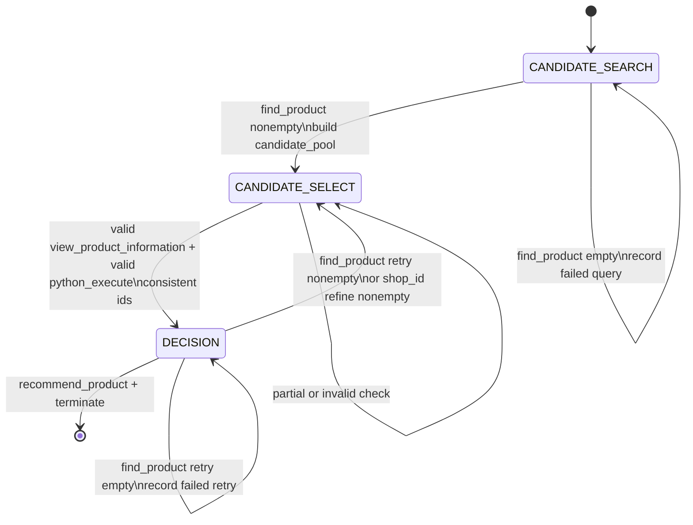

# ShoppingBench Harness FSM

This document defines the fixed state machine for the ShoppingBench voucher/budget agent harness.

The harness has two goals:

1. Guide the model toward correct tool choices and product decisions.
2. Replace raw history concatenation with compact state to reduce memory and compute cost.

## States

The harness uses three states:

```text
CANDIDATE_SEARCH
CANDIDATE_SELECT
DECISION
```

### CANDIDATE_SEARCH

Meaning:

```text
Cold-start search. The agent has not yet obtained any non-empty search result.
```

Allowed tools:

```text
find_product
```

Expected action:

```text
find_product x N
```

Independent searches should be placed in the same `<tool_call>` JSON array.

Initial state can be empty:

```json
{}
```

`CANDIDATE_SEARCH` state has only one responsibility: record failed searches
that returned empty results. It should not duplicate the user query, voucher
rules, candidate pools, or the current state name.

If all searches return empty results, the agent stays in `CANDIDATE_SEARCH`.
The state should record failed search attempts so the model does not repeat
the exact same `find_product` parameters:

```json
{
  "failed_searches": [
    {"q": "...", "page": 1}
  ]
}
```

Use a sparse parameter record for each failed `find_product` call. Only include
parameters that were actually present and non-empty:

```json
{
  "failed_searches": [
    {"q": "wireless earbuds", "page": 1},
    {"q": "phone case", "page": 1, "service": "freeShipping"}
  ]
}
```

Allowed keys inside each `failed_searches` item:

```text
q, page, shop_id, price, sort, service
```

### CANDIDATE_SELECT

Meaning:

```text
At least one non-empty search result is available. The model should select candidate products
from the candidate pool, then inspect details and compute voucher/budget eligibility.
```

Allowed tools:

```text
view_product_information
python_execute
```

Expected action:

```text
view_product_information + python_execute
```

These actions can run in the same turn because `python_execute` uses selected product ids,
shop ids, and prices from the candidate pool, while voucher/budget rules remain in the
user query. It must not depend on the same-turn `view_product_information` observation.

The state should contain only the information needed for current candidate
selection. It should not duplicate the user query, parsed voucher rules, search
attempts, failed searches, source search ids, raw search observations, or the
current state name. Voucher and budget rules are left in the user query for the
agent to interpret when it writes the budget calculation.

```json
{
  "candidate_pool": [
    {
      "product_id": "...",
      "shop_id": "...",
      "title": "...",
      "price": 123,
      "service": [],
      "sold_count": 100
    }
  ]
}
```

`candidate_pool` is a flat list in the first version. It is built from all
non-empty `find_product` observations in the current selection window, not only
from the latest search batch. After a non-empty retry from `DECISION`, the pool
also carries forward the previously selected products so a multi-item task can
keep valid products and replace only failed products.

`previous_decision` is present only after `DECISION` found non-empty retry
results. It carries compact observation-derived evidence from the previous
checked selection so the agent can avoid repeating the same failed selection
while still keeping products that appear valid.

```json
{
  "candidate_pool": [],
  "previous_decision": {
    "selected_products": [],
    "viewed_products": [],
    "budget_calculation": {}
  }
}
```

Example:

```json
{
  "candidate_pool": [
    {
      "product_id": "1001",
      "shop_id": "s88",
      "title": "Black wireless earbuds with charging case",
      "price": 180,
      "service": ["freeShipping"],
      "sold_count": 20
    }
  ]
}
```

If later rollouts show that multi-item requests are hard to resolve from titles
alone, the schema can be extended to grouped candidates outside this first
contract.

### DECISION

Meaning:

```text
Product details and budget calculation are available. The model should either recommend
and terminate, or search again for replacement candidates.
```

Allowed tools:

```text
recommend_product
terminate
find_product
```

Expected successful action:

```text
recommend_product + terminate
```

Expected retry action:

```text
find_product x N
```

For shop-scoped vouchers, a retry can use `find_product` with `shop_id`. This is the
shop-refine behavior. It is not a separate state; it is a retry search strategy inside
`DECISION`.

If a retry search returns non-empty results, the agent moves to `CANDIDATE_SELECT`.
If a retry search returns empty results, the agent stays in `DECISION` and records the
failed retry query while preserving the current verification/budget context.

The state should contain only the evidence needed to decide whether to finish
or search for replacement candidates. It should preserve enough feedback from
the previous candidate check so replacement searches can target the actual
failure reason.

```json
{
  "selected_products": [
    {
      "product_id": "...",
      "shop_id": "...",
      "title": "...",
      "price": 123,
      "service": [],
      "sold_count": 100
    }
  ],
  "selected_shop_ids": ["..."],
  "view_requested_product_ids": ["..."],
  "viewed_products": [
    {
      "product_id": "...",
      "title": "...",
      "description": "...",
      "sku_options": {},
      "attributes": {},
      "service": []
    }
  ],
  "budget_product_ids": ["..."],
  "budget_calculation": {
    "product_ids": ["..."],
    "shop_ids": ["..."],
    "total_before_voucher": 300,
    "meets_threshold": true,
    "eligible_scope": true,
    "voucher_used": true,
    "payable_total": 250,
    "budget": 260,
    "within_budget": true,
    "_tool_success": true,
    "_parse_ok": true
  },
  "selection_consistency": true,
  "failed_retry_searches": []
}
```

`selected_products` comes from the candidate pool selected in
`CANDIDATE_SELECT`. It keeps search-level evidence such as title, price, shop,
and service.

`viewed_products` comes from product detail inspection. It is used to judge
whether selected products match the user's requested attributes, SKU options,
model, color, size, material, service requirements, and similar constraints.

`view_requested_product_ids` comes from the `view_product_information`
parameters. `budget_product_ids` comes from the structured `python_execute`
output. The harness only enters `DECISION` when the budget output includes
product ids and those ids are consistent with the viewed ids. Product id order
does not need to match between the detail check and budget calculation.
Multiple valid `view_product_information` calls in the same selection window are
merged before this consistency check.

`budget_calculation` comes from the `python_execute` observation. The harness
parses the tool output if it is JSON, but it does not parse voucher or budget
rules from the user query. `_tool_success` and `_parse_ok` record whether the
tool result was usable as structured evidence.

To enter `DECISION`, the parsed budget calculation must include usable
`product_ids`, `shop_ids`, `total_before_voucher`, `payable_total`, `budget`,
`within_budget`, and `voucher_used`. The `shop_ids` length must match
`product_ids`, and the viewed product ids must all be present in the detail
observation.

`selection_consistency` records that the viewed product ids and budget product
ids are consistent for this decision state.

`failed_retry_searches` records empty `find_product` attempts that should not
be repeated while searching for replacements. This includes empty cold-start
searches carried forward into `DECISION` and empty retry searches from
`DECISION`. Use sparse `find_product` parameter records, with the same allowed
keys as `CANDIDATE_SEARCH.failed_searches`:

```text
q, page, shop_id, price, sort, service
```

If `DECISION` calls `find_product` and all retry searches return empty results,
the harness stays in `DECISION`, preserves `selected_products`,
`viewed_products`, and `budget_calculation`, and appends those empty retry
search parameters to `failed_retry_searches`.

## Transitions

```text
CANDIDATE_SEARCH -- find_product nonempty --> CANDIDATE_SELECT
CANDIDATE_SEARCH -- find_product empty --> CANDIDATE_SEARCH

CANDIDATE_SELECT -- valid view_product_information + valid python_execute with consistent ids --> DECISION
CANDIDATE_SELECT -- partial/invalid check --> CANDIDATE_SELECT

DECISION -- recommend_product + terminate --> DONE
DECISION -- find_product retry nonempty / shop_id refine nonempty --> CANDIDATE_SELECT
DECISION -- find_product retry empty --> DECISION
```

## State Diagram



## Tool Sets By State

```text
CANDIDATE_SEARCH:
  include_tools = {find_product}

CANDIDATE_SELECT:
  include_tools = {view_product_information, python_execute}

DECISION:
  include_tools = {find_product, recommend_product, terminate}
```

## Notes

- State names describe what information the model has at the start of the turn.
- The harness decides the current state from previous tool calls and observations.
- The model does not declare the state.
- State tool sets are enforced by the harness. A tool call outside the current
  state's tool set is returned as a structured error observation and is not
  executed.
- In `DECISION`, `terminate` is only executed when it appears with
  `recommend_product`. Lone `terminate` and mixed search/terminal actions are
  rejected as structured error observations.
- The `<state>` block contains only information directly available from tool
  observations and needed for the current state decision. Structured data that
  would require parsing the user query, such as voucher rules, is not added to
  `<state>`.
- Search attempts are also saved outside `<state>` as a markdown trace. The
  trace is for harness/debug use when search history is needed later; the active
  `<state>` only carries failed search parameters when they are directly needed
  to avoid repeating empty searches.
- `CANDIDATE_SEARCH` is cold-start only. Once the agent has entered `CANDIDATE_SELECT`,
  it should not return to `CANDIDATE_SEARCH`; later retry searches happen inside `DECISION`.
- Multiple `find_product` calls can be placed in one turn; runtimes may execute
  them in parallel up to `max_parallel_calls`.
- `recommend_product` and `terminate` can be in the same turn because `terminate` does not
  depend on the observation from `recommend_product`.
