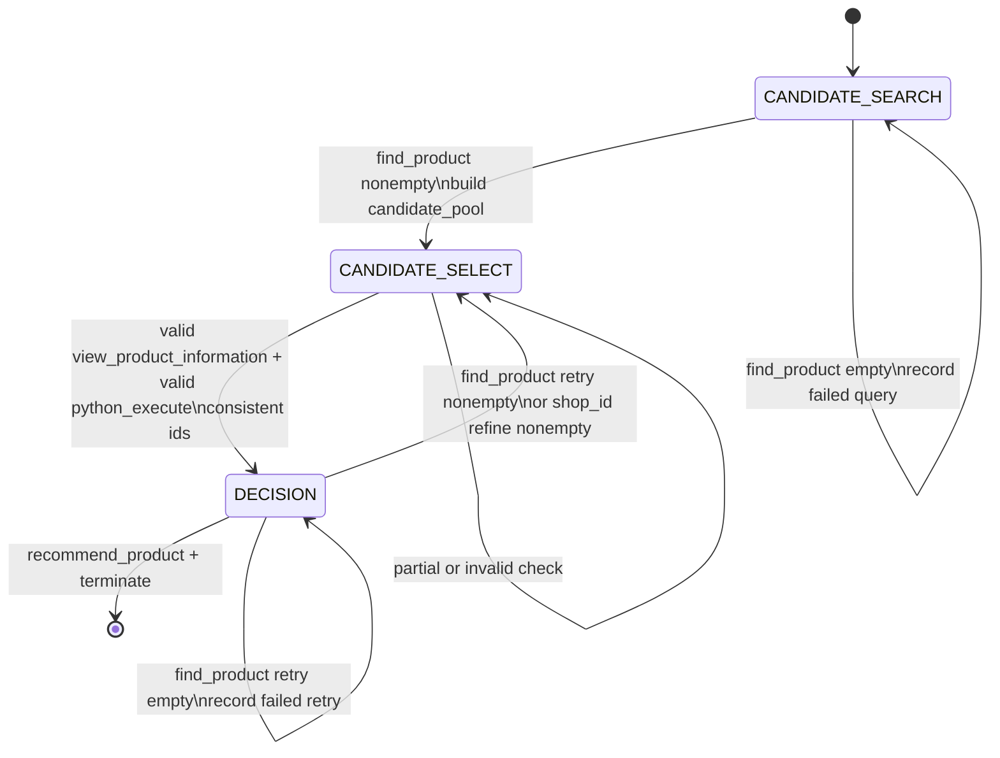

# ShoppingBench Harness FSM

This document defines the fixed state machine for the ShoppingBench voucher/budget agent harness.

The harness has two goals:

1. Guide the model toward correct tool choices and product decisions.
2. Replace raw history concatenation with compact state to reduce memory and compute cost.

## States

The harness uses three states:

```text
CANDIDATE_SEARCH
CANDIDATE_SELECT
DECISION
```

## State Determination Algorithm

The model never declares the current state. At the start of every assistant
turn, the harness rebuilds the state from the structured history of previous
tool calls and tool observations.

The input to the state builder is the folded dialogue history:

```text
<user>...</user>
<tool_call>...</tool_call>
<obs>...</obs>
```

The harness parses each assistant/tool turn into records:

```json
{
  "name": "tool_name",
  "parameters": {},
  "results": {}
}
```

Only structured `tool_call` parameters and `obs.results` are used to determine
the state. The harness does not infer state from the user's natural-language
intent, and it does not parse voucher or budget rules from the user query into
`<state>`.

The state builder follows this order:

1. If there are no previous tool turns, return `CANDIDATE_SEARCH` with an empty
   state.
2. Scan all previous turns for valid SELECT checks. A valid SELECT check is a
   structurally valid `view_product_information` plus a structurally valid
   `python_execute` budget calculation for the same selected product ids.
3. If no valid SELECT check exists:
   - If no non-empty `find_product` result has ever been observed, return
     `CANDIDATE_SEARCH`.
   - If any non-empty `find_product` result has been observed, return
     `CANDIDATE_SELECT`.
4. If at least one valid SELECT check exists, use the latest valid check as the
   current verified selection.
5. Inspect only `find_product` calls after that latest valid check:
   - If there is no non-empty retry result, return `DECISION`.
   - If there is a non-empty retry result, return `CANDIDATE_SELECT` with a new
     candidate pool built from the previous selected products plus the retry
     results.

This means `CANDIDATE_SEARCH` is only the cold-start search state. Once the
harness has observed a non-empty search result, later replacement searches occur
inside `DECISION`; the harness does not return to cold-start
`CANDIDATE_SEARCH`.

Only a real empty search result is treated as a failed search:

```text
results == []
```

Malformed observations, `None`, and error dictionaries such as
`{"error": "..."}` are not treated as empty searches and are not added to
`failed_searches` or `failed_retry_searches`.

### CANDIDATE_SEARCH

Meaning:

```text
Cold-start search. The agent has not yet obtained any non-empty search result.
```

Allowed tools:

```text
find_product
```

Expected action:

```text
find_product x N
```

Independent searches should be placed in the same `<tool_call>` JSON array.

Initial state can be empty:

```json
{}
```

`CANDIDATE_SEARCH` state has only one responsibility: record failed searches
that returned empty results. It should not duplicate the user query, voucher
rules, candidate pools, or the current state name.

If all searches return empty results, the agent stays in `CANDIDATE_SEARCH`.
The state should record failed search attempts so the model does not repeat
the exact same `find_product` parameters:

```json
{
  "failed_searches": [
    {"q": "...", "page": 1}
  ]
}
```

Use a sparse parameter record for each failed `find_product` call. Only include
parameters that were actually present and non-empty:

```json
{
  "failed_searches": [
    {"q": "wireless earbuds", "page": 1},
    {"q": "phone case", "page": 1, "service": "freeShipping"}
  ]
}
```

Allowed keys inside each `failed_searches` item:

```text
q, page, shop_id, price, sort, service
```

### CANDIDATE_SELECT

Meaning:

```text
At least one non-empty search result is available. The model should select candidate products
from the candidate pool, then inspect details and compute voucher/budget eligibility.
```

Allowed tools:

```text
view_product_information
python_execute
```

Expected action:

```text
view_product_information + python_execute
```

These actions can run in the same turn because `python_execute` uses selected product ids,
shop ids, and prices from the candidate pool, while voucher/budget rules remain in the
user query. It must not depend on the same-turn `view_product_information` observation.

The state should contain only the information needed for current candidate
selection. It should not duplicate the user query, parsed voucher rules, search
attempts, failed searches, source search ids, raw search observations, or the
current state name. Voucher and budget rules are left in the user query for the
agent to interpret when it writes the budget calculation.

```json
{
  "candidate_pool": [
    {
      "product_id": "...",
      "shop_id": "...",
      "title": "...",
      "price": 123,
      "service": [],
      "sold_count": 100
    }
  ]
}
```

`candidate_pool` is a flat list in the first version. It is built from all
non-empty `find_product` observations in the current selection window, not only
from the latest search batch. After a non-empty retry from `DECISION`, the pool
also carries forward the previously selected products so a multi-item task can
keep valid products and replace only failed products.

In `CANDIDATE_SELECT`, selected product ids must come from the currently exposed
`candidate_pool`. Earlier search results that are not carried into the current
pool are not valid choices for the current selection window.

`previous_decision` is present only after `DECISION` found non-empty retry
results. It carries compact observation-derived evidence from the previous
checked selection so the agent can avoid repeating the same failed selection
while still keeping products that appear valid.

```json
{
  "candidate_pool": [],
  "previous_decision": {
    "selected_products": [],
    "viewed_products": [],
    "budget_calculation": {}
  }
}
```

Example:

```json
{
  "candidate_pool": [
    {
      "product_id": "1001",
      "shop_id": "s88",
      "title": "Black wireless earbuds with charging case",
      "price": 180,
      "service": ["freeShipping"],
      "sold_count": 20
    }
  ]
}
```

If later rollouts show that multi-item requests are hard to resolve from titles
alone, the schema can be extended to grouped candidates outside this first
contract.

### Valid SELECT Check

A valid SELECT check is the only way to move from `CANDIDATE_SELECT` to
`DECISION`. It is also the evidence base that `DECISION` uses to decide whether
to recommend or search again.

The check may happen in one assistant turn:

```text
view_product_information + python_execute
```

or across multiple `CANDIDATE_SELECT` turns, as long as the latest accumulated
valid view evidence and the budget calculation refer to the same selected
product ids.

The harness accepts a SELECT check only if all of the following are true:

1. `view_product_information` was called with non-empty `product_ids`.
2. The view observation is a list.
3. Every requested product id appears in the view observation.
4. `python_execute` returned a tool result with usable text in `stdout` or
   `observation`.
5. That text parses as a JSON object.
6. The parsed JSON includes:
   - `product_ids`
   - `shop_ids`
   - `total_before_voucher`
   - `payable_total`
   - `budget`
   - `within_budget`
   - `voucher_used`
7. `shop_ids` is a list with the same length as `product_ids`.
8. `within_budget` and `voucher_used` are booleans.
9. `total_before_voucher`, `payable_total`, and `budget` are numeric.
10. Product ids are not repeated. Quantity is not represented by duplicate ids
    in this schema.
11. The viewed product ids and budget product ids are the same set. Product id
    order does not matter.
12. Every selected product id comes from the active `candidate_pool`.
13. Every reported `shop_id` matches the observed `shop_id` for that product.
14. `total_before_voucher` matches the sum of observed candidate prices.
15. `within_budget` matches `payable_total <= budget`.

The harness intentionally does not recompute voucher eligibility from the user
query. Voucher scope, thresholds, discount formulas, and budget semantics remain
in the raw user query and must be interpreted by the agent when it writes and
later evaluates the budget calculation.

If any condition above fails, the harness stays in `CANDIDATE_SELECT` and
rebuilds the same current candidate-selection state instead of entering
`DECISION`.

### DECISION

Meaning:

```text
Product details and budget calculation are available. The model should either recommend
and terminate, or search again for replacement candidates.
```

Allowed tools:

```text
recommend_product
terminate
find_product
```

Expected successful action:

```text
recommend_product + terminate
```

Expected retry action:

```text
find_product x N
```

For shop-scoped vouchers, a retry can use `find_product` with `shop_id`. This is the
shop-refine behavior. It is not a separate state; it is a retry search strategy inside
`DECISION`.

If a retry search returns non-empty results, the agent moves to `CANDIDATE_SELECT`.
If a retry search returns empty results, the agent stays in `DECISION` and records the
failed retry query while preserving the current verification/budget context.

The state should contain only the evidence needed to decide whether to finish
or search for replacement candidates. It should preserve enough feedback from
the previous candidate check so replacement searches can target the actual
failure reason.

```json
{
  "selected_products": [
    {
      "product_id": "...",
      "shop_id": "...",
      "title": "...",
      "price": 123,
      "service": [],
      "sold_count": 100
    }
  ],
  "selected_shop_ids": ["..."],
  "view_requested_product_ids": ["..."],
  "viewed_products": [
    {
      "product_id": "...",
      "title": "...",
      "description": "...",
      "sku_options": {},
      "attributes": {},
      "service": []
    }
  ],
  "budget_product_ids": ["..."],
  "budget_calculation": {
    "product_ids": ["..."],
    "shop_ids": ["..."],
    "total_before_voucher": 300,
    "meets_threshold": true,
    "eligible_scope": true,
    "voucher_used": true,
    "payable_total": 250,
    "budget": 260,
    "within_budget": true,
    "_tool_success": true,
    "_parse_ok": true
  },
  "selection_consistency": true,
  "failed_retry_searches": []
}
```

`selected_products` comes from the candidate pool selected in
`CANDIDATE_SELECT`. It keeps search-level evidence such as title, price, shop,
and service.

`viewed_products` comes from product detail inspection. It is used to judge
whether selected products match the user's requested attributes, SKU options,
model, color, size, material, service requirements, and similar constraints.

`view_requested_product_ids` comes from the `view_product_information`
parameters. `budget_product_ids` comes from the structured `python_execute`
output. The harness only enters `DECISION` when the budget output includes
product ids and those ids are consistent with the viewed ids. Product id order
does not need to match between the detail check and budget calculation.
Repeated product ids are not accepted; quantity is not represented by duplicate
ids in this schema.
Multiple valid `view_product_information` calls in the same selection window are
merged before this consistency check.

`budget_calculation` comes from the `python_execute` observation. The harness
parses the tool output if it is JSON, but it does not parse voucher or budget
rules from the user query. `_tool_success` and `_parse_ok` record whether the
tool result was usable as structured evidence.

To enter `DECISION`, the parsed budget calculation must include usable
`product_ids`, `shop_ids`, `total_before_voucher`, `payable_total`, `budget`,
`within_budget`, and `voucher_used`. The `shop_ids` length must match
`product_ids`, and the viewed product ids must all be present in the detail
observation. The harness also checks the calculation against structured
candidate evidence: every selected product id must come from observed
`candidate_pool` evidence, the reported `shop_ids` must match observed product
shop ids, `total_before_voucher` must match the sum of observed candidate
prices, and `within_budget` must match `payable_total <= budget`. The harness
still does not parse voucher rules from the user query.

`selection_consistency` records that the viewed product ids and budget product
ids are consistent for this decision state.

`failed_retry_searches` records empty `find_product` attempts that should not
be repeated while searching for replacements. This includes empty cold-start
searches carried forward into `DECISION` and empty retry searches from
`DECISION`. Use sparse `find_product` parameter records, with the same allowed
keys as `CANDIDATE_SEARCH.failed_searches`:

```text
q, page, shop_id, price, sort, service
```

If `DECISION` calls `find_product` and all retry searches return empty results,
the harness stays in `DECISION`, preserves `selected_products`,
`viewed_products`, and `budget_calculation`, and appends those empty retry
search parameters to `failed_retry_searches`.

## Transitions

```text
CANDIDATE_SEARCH -- find_product nonempty --> CANDIDATE_SELECT
CANDIDATE_SEARCH -- find_product empty --> CANDIDATE_SEARCH

CANDIDATE_SELECT -- valid view_product_information + valid python_execute with consistent ids --> DECISION
CANDIDATE_SELECT -- partial/invalid check --> CANDIDATE_SELECT

DECISION -- recommend_product + terminate --> DONE
DECISION -- find_product retry nonempty / shop_id refine nonempty --> CANDIDATE_SELECT
DECISION -- find_product retry empty --> DECISION
```

More explicitly:

- Initial turn always starts in `CANDIDATE_SEARCH`.
- `CANDIDATE_SEARCH -> CANDIDATE_SEARCH` happens only when every observed
  `find_product` result so far is an empty list.
- `CANDIDATE_SEARCH -> CANDIDATE_SELECT` happens as soon as at least one
  non-empty `find_product` result is observed.
- `CANDIDATE_SELECT -> CANDIDATE_SELECT` happens when no valid SELECT check has
  been observed yet.
- `CANDIDATE_SELECT -> DECISION` happens when a valid SELECT check is observed.
- `DECISION -> DECISION` happens when there is a latest valid SELECT check and
  no later non-empty retry search exists. Empty retry searches are recorded in
  `failed_retry_searches`.
- `DECISION -> CANDIDATE_SELECT` happens when a `find_product` call after the
  latest valid SELECT check returns non-empty results.

## State Diagram



## Tool Sets By State

```text
CANDIDATE_SEARCH:
  include_tools = {find_product}

CANDIDATE_SELECT:
  include_tools = {view_product_information, python_execute}

DECISION:
  include_tools = {find_product, recommend_product, terminate}
```

## Runtime Protocol Enforcement

State prompts tell the model what to do, but the runtime also enforces the FSM
contract. Invalid calls are returned as structured error observations and are
not executed.

The runtime rejects:

- Any tool outside the current state's tool set.
- A `find_product` call that exactly repeats a sparse parameter record in
  `failed_searches` or `failed_retry_searches`.
- In `DECISION`, mixing `find_product` with `recommend_product` or `terminate`
  in the same action array.
- In `DECISION`, lone `recommend_product`.
- In `DECISION`, lone `terminate`.
- Multiple `<tool_call>` blocks in one assistant output. Multiple calls must be
  placed inside a single JSON array in one `<tool_call>` block.
- In VERL rollout, calls beyond `max_parallel_calls`; those extra calls receive
  structured `too_many_parallel_calls` errors instead of being silently dropped.

The successful terminal action is therefore:

```text
recommend_product + terminate
```

in one `<tool_call>` JSON array. `terminate` does not depend on the observation
from `recommend_product`, so they can run in the same turn.

## Notes

- State names describe what information the model has at the start of the turn.
- The harness decides the current state from previous tool calls and observations.
- The model does not declare the state.
- State tool sets are enforced by the harness. A tool call outside the current
  state's tool set is returned as a structured error observation and is not
  executed.
- In `DECISION`, `recommend_product` and `terminate` must appear together.
  Lone `recommend_product`, lone `terminate`, and mixed search/terminal actions
  are rejected as structured error observations.
- A `find_product` call that exactly repeats a sparse parameter record in
  `failed_searches` or `failed_retry_searches` is rejected as a structured error
  observation and is not executed.
- The `<state>` block contains only information directly available from tool
  observations and needed for the current state decision. Structured data that
  would require parsing the user query, such as voucher rules, is not added to
  `<state>`.
- Search attempts are also saved outside `<state>` as a markdown trace. The
  trace is for harness/debug use when search history is needed later; the active
  `<state>` only carries failed search parameters when they are directly needed
  to avoid repeating empty searches.
- `CANDIDATE_SEARCH` is cold-start only. Once the agent has entered `CANDIDATE_SELECT`,
  it should not return to `CANDIDATE_SEARCH`; later retry searches happen inside `DECISION`.
- Multiple `find_product` calls can be placed in one turn; runtimes may execute
  them in parallel up to `max_parallel_calls`.
- `recommend_product` and `terminate` can be in the same turn because `terminate` does not
  depend on the observation from `recommend_product`.
- A FSM assistant output must contain exactly one `<tool_call>` block. Multiple
  calls belong inside that single JSON array; multiple `<tool_call>` blocks are
  treated as invalid format.
